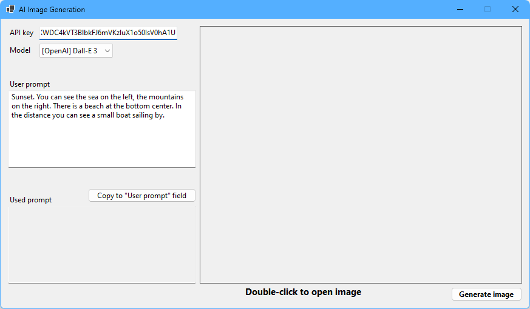
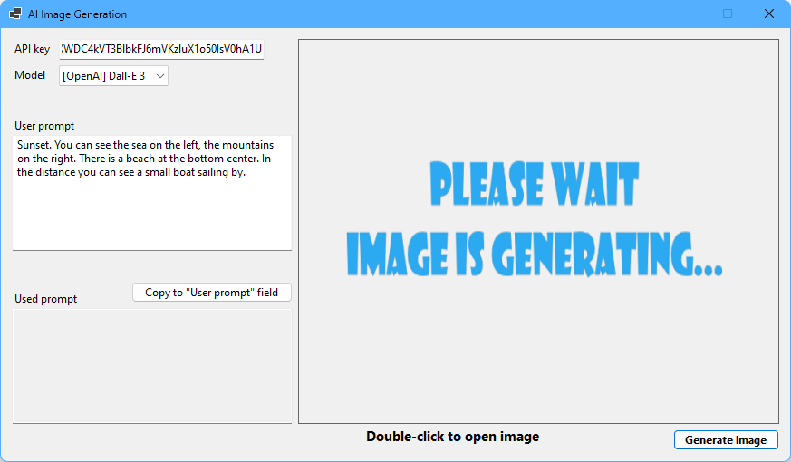
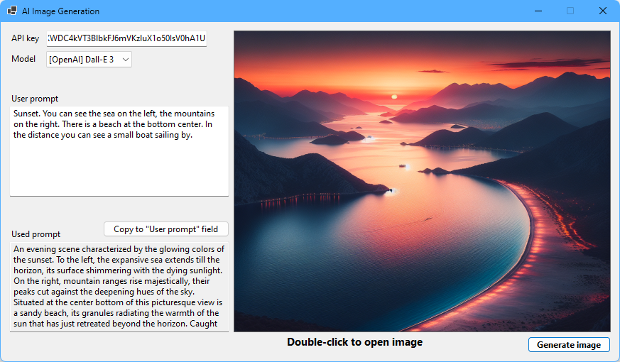

# AI Image generation

Simple WinForms app to generate images using Open AI Dall-E models.

Under the hood the app use the OpenAI API to generate images.  
Endpoint: `POST https://api.openai.com/v1/images/generations`  
[https://platform.openai.com/docs/api-reference/images](https://platform.openai.com/docs/api-reference/images)

The app is very simple.

- 🔑 Enter the OpenAI API key
- 🖌️ Select the model: **Dall-E 2** or **Dall-E 2**
- 🔠 Enter your prompt, what do you want to be on an image
- 🧑‍🏭 Click "Generate Image" (right bottom corner)
- ⏰ Wait couple seconds and that's it :smile:
- 🖼️ Double click on the image will open it in external photo viewer app
- 📁 All generated images are saved in `images` folder

